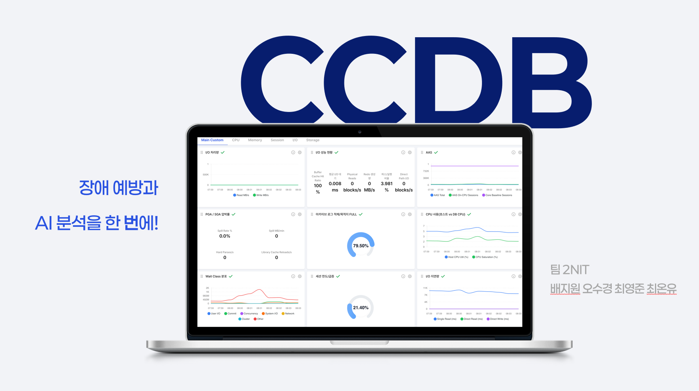
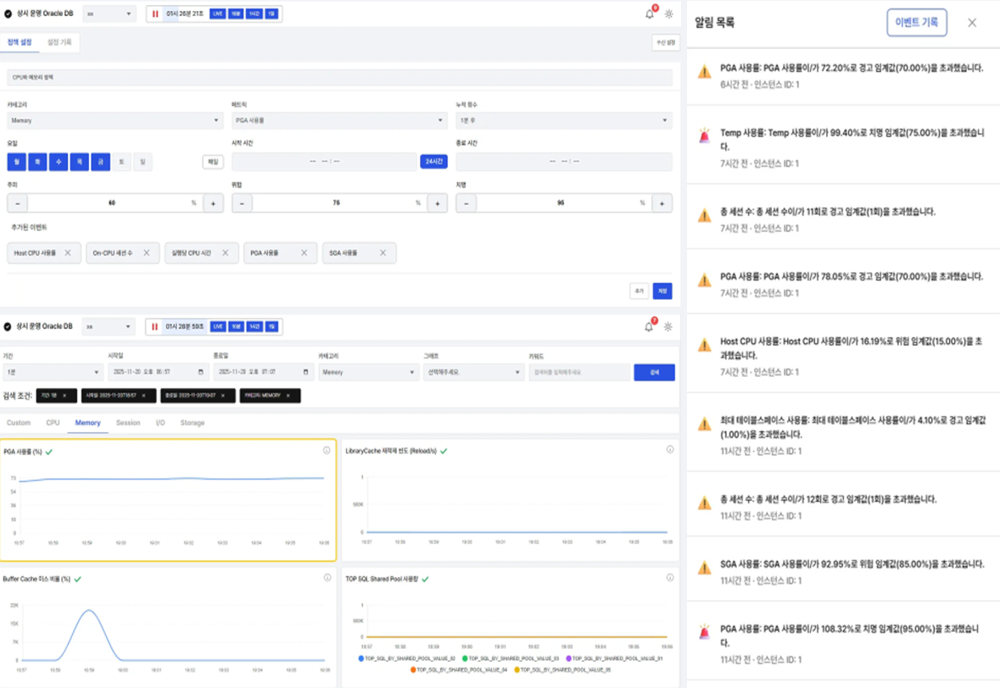
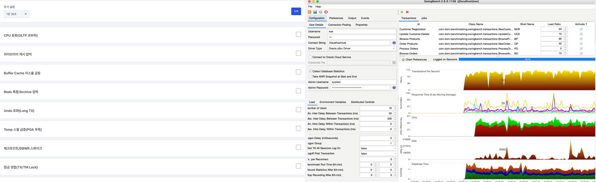
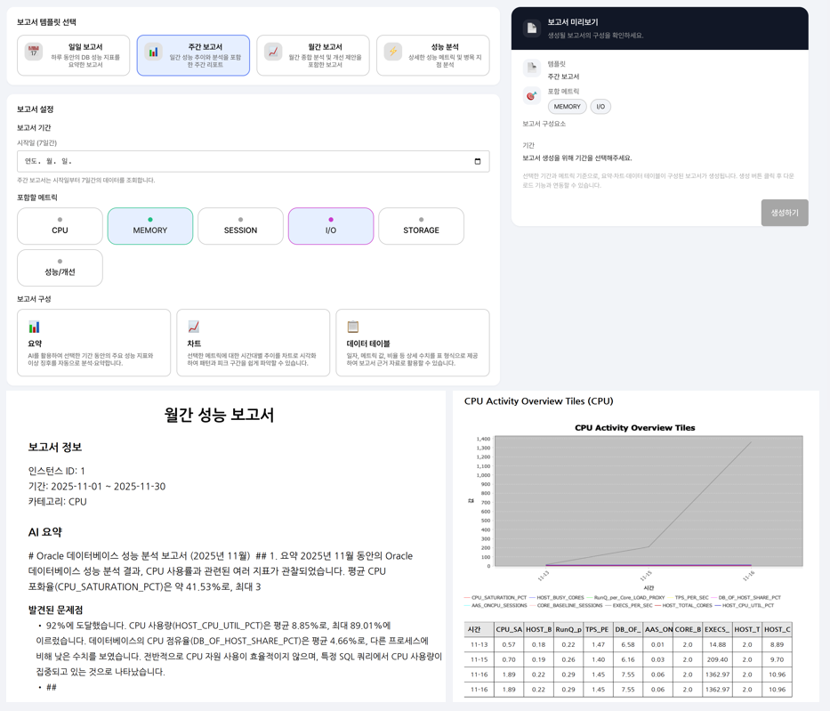
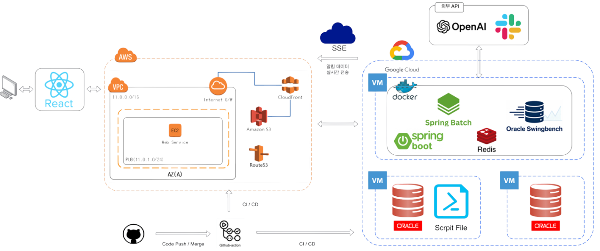
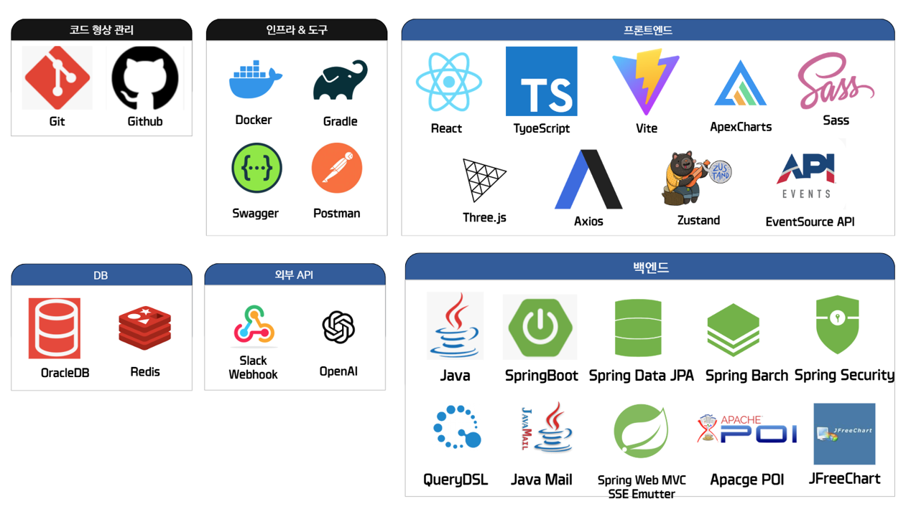

# 👀 CCDB

#### Oracle, Java, React 를 활용한 데이터베이스 모니터링 웹 서비스입니다.  

## 📌 Intro

- 사용자는 대시보드에서 DB 인스턴스의 실시간 상태를 시각적으로 확인할 수 있습니다. 
- CPU·메모리·세션·I/O·스토리지 등 주요 지표를 다양한 차트로 모니터링할 수 있습니다. 
- SQL 통계와 TOP 쿼리 분석 기능을 통해 성능 문제를 빠르게 파악하고 최적화할 수 있습니다.

## 🖥️ Screen
### 대시보드 

### SQL 

### 알림 

### 진단

### 보고서 

### 히스토리

### 설정

## ⚒️ Architecture

## ⚒️ Tech Stack

## 💬 Communication

## 📁 Repository

| Type 	| Repository			|
|-------|-----------------------|
| **프론트엔드** | https://github.com/SYS-2nit/CCDB-Frontend |
| **백엔드** | https://github.com/SYS-2nit/CCDB-Backend |

## 👩🏻‍💻 Developer

| 최영준 | 최온유 | 배지원 | 오수경 |
|:---:|:---:|:---:|:---:|
|  |  |  |
